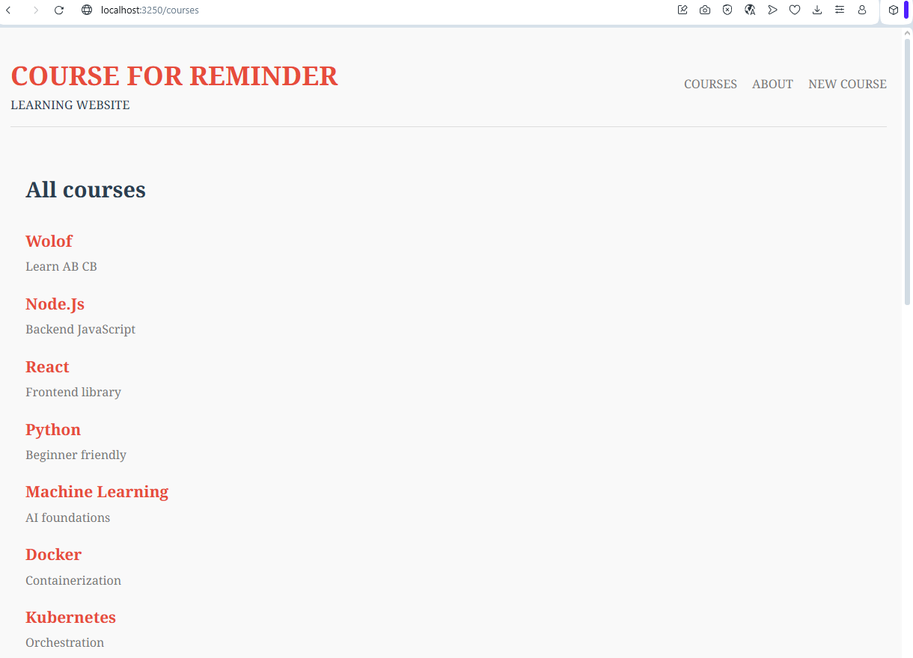

# SBA-319-MongoD-Database-Application

# Course App 
For now, I just created views for coures datas

**Short description**  
This is a small Express + MongoDB app that manages **Users**, **Courses**, and **Comments**.  
It exposes a RESTful API (GET/POST/PATCH/DELETE), includes simple server-side rendered views (EJS) with a CSS stylesheet and a form to interact with the API, and demonstrates sensible data modeling, validation, and indexes.

---

## For the requirements
- **Three collections**: `users`, `courses`, `comments`.
- **POST routes**: create users, courses, comments (client can create via POST).
- **PATCH/PUT routes**: update users and courses via PATCH (client manipulation supported).
- **DELETE routes**: delete users and courses via DELETE (client deletion supported).
- **Query parameters**: filter courses (title=Node or createdBy= userId).
- **Route parameters**: resource IDs used as route params ( /api/courses/:id).
- **RESTful principles**: resource-oriented routes, use of HTTP verbs, stateless endpoints.
- **Rendered view**: at least one EJS view (/courses and /courses/create) with simple CSS.
- **Form**: included in the rendered view to POST a new course.
- **Validation & indexes**: Mongoose schema validations and sensible indexes (unique email on users, index on course title).
- **No API keys**: project uses no API keys.

---

## Views examples

